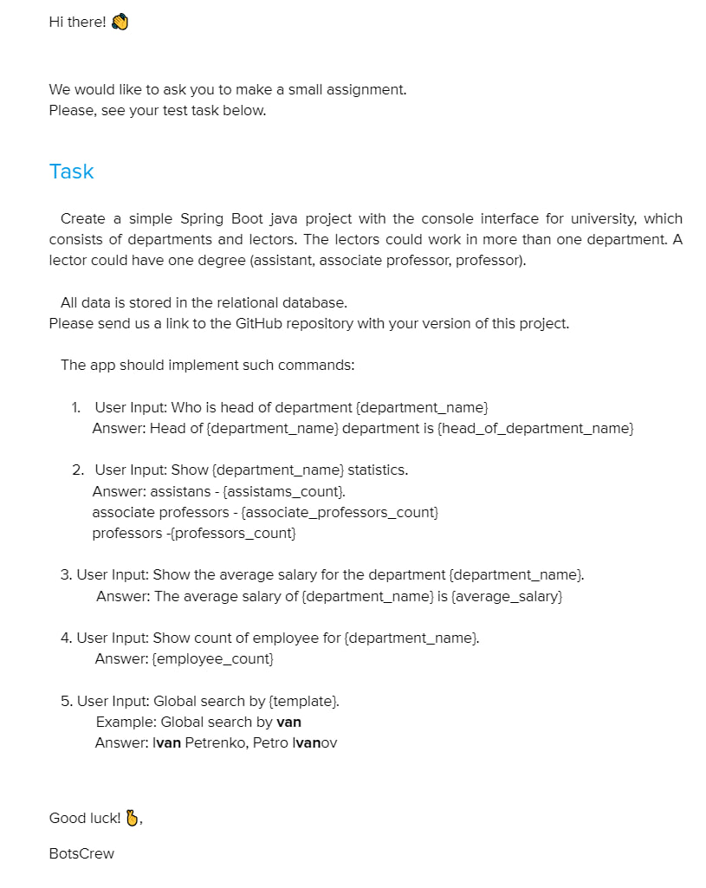
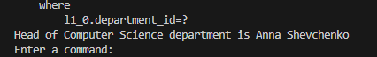
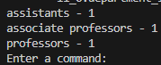
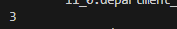

## Завдання Єсип Дмитро



## Кверя БД (як БД використав PostgeSQL, також використав liquibase для міграцій)

```SQL
INSERT INTO lector (name, degree, salary)
VALUES
('Anna Shevchenko', 'PROFESSOR', 1500),
('Petro Ivanov', 'ASSOCIATE_PROFESSOR', 2000),
('Oleh Kovalenko', 'PROFESSOR', 2500),
('Nadiya Symonenko', 'ASSISTANT', 1600),
('Mykola Tkachenko', 'ASSOCIATE_PROFESSOR', 2100),
('Svitlana Melnyk', 'PROFESSOR', 2600),
('Volodymyr Stepanyuk', 'ASSISTANT', 1700),
('Yulia Kravets', 'ASSOCIATE_PROFESSOR', 2200),
('Oleksandr Bondarenko', 'PROFESSOR', 2700);

INSERT INTO department (name, head_of_department_id)
VALUES
('Computer Science', 1),  -- Anna Shevchenko є головою департаменту
('Mathematics', 2),      -- Petro Ivanov є головою департаменту
('Physics', 3);          -- Oleh Kovalenko є головою департаменту

INSERT INTO department_lector (department_id, lector_id)
VALUES
(1, 1),  -- Computer Science
(1, 4),  -- Computer Science
(1, 6),  -- Computer Science / Mathematics
(1, 5),  -- Computer Science
(2, 2),  -- Mathematics
(2, 6),  -- Mathematics
(2, 7),  -- Mathematics
(3, 3),  -- Physics
(3, 8),  -- Physics
(3, 9);  -- Physics
```

## Приклади виконання завдання
#### Who is head of department Computer Science:



#### Show Computer Science statistics:



#### Show the average salary for the department Computer Science:


#### Show count of employee for Computer Science:


#### Global search by nko:

